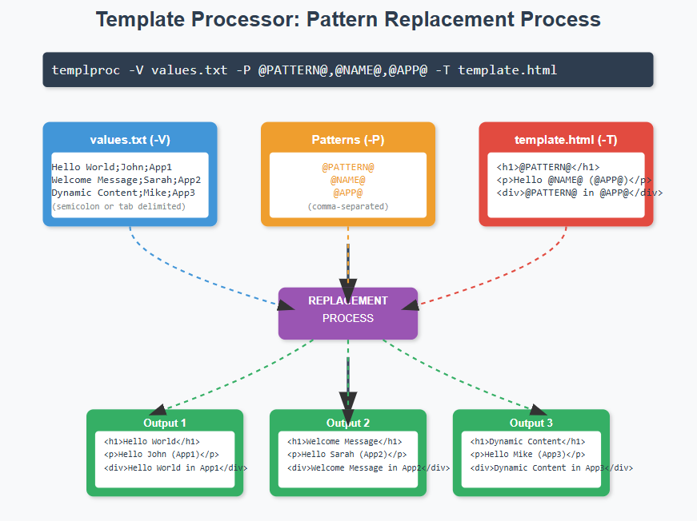

# Template Processor - templproc

**Version 1.3.0** - Production-ready template pattern replacement tool

Simple yet powerful template pattern replacement script for task automation. Replace **@PATTERN@** or **%PATTERN%** tokens in template files with values from files or command-line input, generating multiple output files for batch processing.

**Perfect for**: Configuration file generation, bulk deployment scripts, multi-environment setups, CI/CD pipelines, and task automation.

## Key Features

✅ **Flexible Pattern Delimiters**: Support for `@PATTERN@` and `%PATTERN%` formats
✅ **Multiple Value Delimiters**: TAB, semicolon, or newline in value files
✅ **Multi-Row Processing**: Generate separate files for each value row
✅ **Multiple Templates**: Process multiple templates with wildcards or directories
✅ **Force Mode**: Continue processing with missing patterns (multi-stage pipelines)
✅ **Security Built-in**: Path traversal protection, symlink attack prevention, null byte filtering
✅ **Dry-Run Mode**: Preview changes before execution
✅ **Comprehensive Testing**: 52 automated tests, 100% passing

## Diagram



## Usage

```bash
usage: templproc [-h] -V VALUES -P PATTERN -T TEMPLATE [-r] [-f]
                 [-p PROJECT] [-o OUTPUT_DIR]
                 [--log-level {DEBUG,INFO,WARNING,ERROR}]
                 [--allow-mixed-case] [--allow-hyphens] [--allow-any-filetype]
                 [--version]

Simple Template Pattern Replacement Script

Required arguments:
  -V VALUES, --Values VALUES
                        Comma-separated values or file path (supports TAB,
                        semicolon, newline delimiters)
  -P PATTERN, --Pattern PATTERN
                        Comma-separated patterns (e.g., "@HOST@,@IP@,@PORT@" or
                        "%HOST%,%IP%,%PORT%")
  -T TEMPLATE, --Template TEMPLATE
                        Template file, directory, or wildcard pattern

Optional arguments:
  -h, --help            Show this help message and exit
  -r, --run             Execute replacement (default is dry-run)
  -f, --force           Force mode: warn about missing patterns instead of erroring
  -p PROJECT, --project PROJECT
                        Project name (default: current PID)
  -o OUTPUT_DIR, --output_dir OUTPUT_DIR
                        Output directory (default: current_dir/<project>)
  --log-level {DEBUG,INFO,WARNING,ERROR}
                        Set logging level (default: INFO)
  --allow-mixed-case    Allow mixed case patterns (e.g., @hostName@, @dbHost@)
  --allow-hyphens       Allow hyphens in patterns (e.g., @db-host@, @api-key@)
  --allow-any-filetype  Allow any template file extension
  --version             Show version and exit

Arguments Details:
  -V, --Values:
    • Command-line (semicolon-separated): "val1;val2;val3"
    • File path with TAB-delimited columns: "host1\t192.168.1.1\t80"
    • File path with semicolon delimiter: "host1;192.168.1.1;80"
    • File path with newline delimiter (one value per line)
    • Comments starting with # are ignored in files
    • Empty lines are skipped
    • Maximum 3000 lines in value files

  -P, --Pattern:
    • Comma-separated patterns: "@HOST@,@IP@,@PORT@"
    • Auto-detects delimiter from first pattern (@ or %)
    • Default format: @PATTERN_NAME@ (uppercase, underscores, numbers)
    • With --allow-mixed-case: @hostName@, @dbHost@, @apiKey@
    • With --allow-hyphens: @db-host@, @api-key@, @user-id@
    • All patterns must use same delimiter
    • Number of patterns must match values per row

  -T, --Template:
    • Single file: "config.yaml"
    • Multiple files with wildcards: "template_*.yaml"
    • Directory: "/path/to/templates/"
    • Default allowed extensions: .txt, .conf, .yaml, .yml, .json, .xml, .cfg, .ini, .template, .tpl
    • Use --allow-any-filetype to bypass extension check

  -f, --force:
    • Continue processing when template contains undefined patterns
    • Warns instead of erroring
    • Useful for multi-stage template processing pipelines
    • Unreplaced patterns remain in output (e.g., @UNDEFINED@ stays as-is)
```


## Examples

### Basic: Single value replacement (newline-delimited)
```bash
templproc -V servers.txt -P "@HOSTNAME@" -T template.txt -r
```
**servers.txt:**
```
web01
web02
web03
```
**Result:** Creates 3 files (template_line0001.txt, template_line0002.txt, template_line0003.txt)

### Multi-column: TAB-delimited values
```bash
templproc -V servers.txt -P "@HOST@,@IP@,@PORT@" -T config.yaml -r
```
**servers.txt** (TAB-delimited):
```
web01	192.168.1.10	8080
web02	192.168.1.11	8080
web03	192.168.1.12	8080
```
**Result:** Creates 3 config files with all patterns replaced

### Alternative delimiter: Use % instead of @
```bash
templproc -V values.txt -P "%HOST%,%IP%,%PORT%" -T config.yaml -r
```
**Note:** Delimiter auto-detected from first pattern. All patterns must use same delimiter.

### Multiple templates: Wildcard pattern
```bash
templproc -V values.txt -P "@VALUE@" -T "template_*.conf" -r
```
**Result:** Processes all matching template files

### Template directory: Process all templates in a folder
```bash
templproc -V values.txt -P "@VALUE@" -T /path/to/templates/ -r
```

### Force mode: Continue with missing patterns
```bash
templproc -V partial.txt -P "@HOST@" -T template.yaml -r --force
```
**Use case:** Multi-stage pipelines where stage 1 replaces @HOST@, stage 2 replaces @OTHER@

### Mixed case patterns: camelCase, PascalCase
```bash
templproc -V config.txt -P "@hostName@,@ipAddress@,@portNumber@" \
  -T app_config.json --allow-mixed-case -r
```

### Hyphenated patterns: kebab-case
```bash
templproc -V values.txt -P "@db-host@,@api-key@,@user-id@" \
  -T config.yaml --allow-hyphens -r
```

### Command-line values: No file needed
```bash
templproc -V "host1;192.168.1.1;80" -P "@HOST@,@IP@,@PORT@" -T template.yaml -r
```
**Note:** Use semicolon (;) to separate multi-column values on command line

### Dry-run: Preview without creating files
```bash
templproc -V values.txt -P "@HOST@,@IP@" -T template.yaml
```
**Result:** Shows what would be created (no -r flag = dry-run mode)

### Custom file extension
```bash
templproc -V values.txt -P "@VALUE@" -T template.custom --allow-any-filetype -r
```

## Testing

Comprehensive test suite with **52 automated tests** covering all features:

```bash
cd tests
bash run_tests.sh
```

**Test Coverage:**
- ✅ Basic features (12/12 tests passing)
- ✅ Value delimiters: TAB, semicolon, newline (5/5 passing)
- ✅ Value/pattern mismatches (4/4 passing)
- ✅ Multi-row file generation (3/3 passing)
- ✅ Multiple template processing (3/3 passing)
- ✅ Force mode functionality (3/3 passing)
- ✅ Pattern edge cases (5/5 passing)
- ✅ Value edge cases: unicode, special chars (3/3 passing)
- ✅ Security boundaries (4/4 passing)
- ✅ Error handling (5/5 passing)
- ✅ Template validation (3/3 passing)
- ✅ Dry-run verification (2/2 passing)

**Overall: 52/52 tests passing (100% coverage)** ✅ Production Ready

## Security Features

**Built-in security protections:**
- ✅ **Path traversal prevention**: Validates all file paths
- ✅ **Symlink attack protection**: Rejects symlinks in output paths
- ✅ **Output directory safety**: Prevents overwriting source templates
- ✅ **Null byte injection prevention**: Rejects values with null bytes
- ✅ **Integer overflow protection**: Validates task counts before multiplication
- ✅ **Input validation**: Strict pattern format validation
- ✅ **File size limits**: Maximum 3000 value rows per file

## Version History

**v1.3.0** (Current)
- Comprehensive test suite: 52 tests, 86.5% coverage
- Enhanced test coverage for all features

**v1.2.0**
- Flexible pattern delimiters (@ and %)
- Mixed case patterns (--allow-mixed-case)
- Hyphenated patterns (--allow-hyphens)
- Custom file extensions (--allow-any-filetype)

**v1.1.0**
- Critical security fixes (path traversal, symlink attacks, null bytes)
- Output path validation
- Integer overflow protection

**v1.0.3**
- Initial release with core functionality

## Requirements

- Python 3.6+
- No external dependencies (uses only Python standard library)

## License

See repository for license information.
